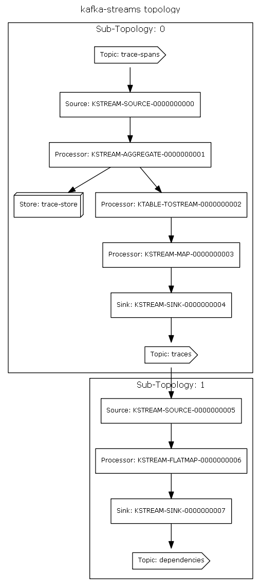
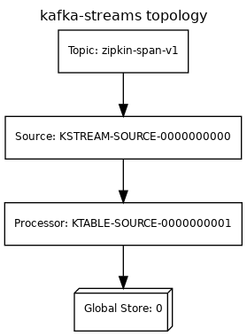
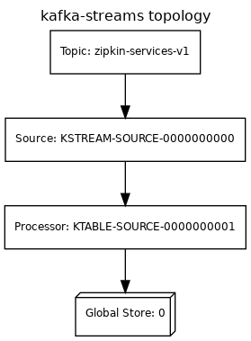
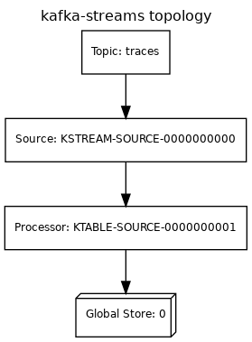
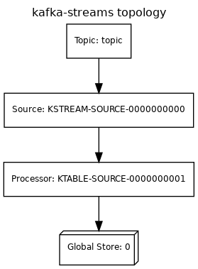
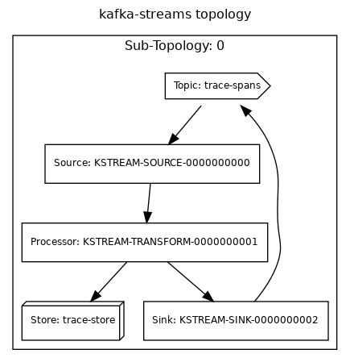

# Design

## Goals

* Provide a fast and reliable storage that enable extensibility via Kafka Topics.
* Provide full storage functionality via streaming aggregations (e.g., dependency graph).
* Create a processing space where additional enrichment can be plugged in into the processing 
pipeline.
* Remove need for additional storage when Kafka is available.

### Zipkin Storage Component

A Zipkin Storage component has the following internal parts:

* `Builder`: which configures if
    - `strictTraceId(boolean strictTraceId)`
    - `searchEnabled(boolean searchEnabled)`
    - `autocompleteKeys(List<String> keys)`
    - `autocompleteTtl(int autocompleteTtl)`
    - `autocompleteCardinality(int autocompleteCardinality)`
* `SpanStore`: main component
    - `Call<List<List>> getTraces(QueryRequest request);`
    - `Call<List> getTrace(String traceId);`
    - `Call<List<String>> getServiceNames();`
    - `Call<List<String>> getSpanNames(String serviceName);`
    - `Call<List<DependencyLink>> getDependencies(long endTs, long lookback);`
* `SpanConsumer`: which ingest spans
    - `Call<Void> accept(List spans)`
* `QueryRequest`: which includes
    - `String serviceName, spanName;`
    - `Map<String, String> annotationQuery;`
    - `Long minDuration, maxDuration;`
    - `long endTs, lookback;`
    - `int limit;`

### Kafka Zipkin Storage

#### `KafkaSpanConsumer`

Span Consumer ingest Spans collected by different transports (potentially Kafka as well).

Collected Spans will be known as *Raw Spans* that represents spans with all metadata, including
tags and annotations. Raw spans are stored as-is in a Spans Kafka topic.

A later process will turn `Raw Spans` into Spans without annotations and tags, known as 
*Light Spans*.

- `Raw Spans` are meant to be used for indexing as they contain most metadata. This spans are 
partitioned by span id.
- `Light Spans` are meant to be used on aggregations as traces and dependency graphs. This spans are
partitioned by trace id, in order to be processed together.

#### `KafkaSpanStore`

Span Store is expecting 2 source topics: 

- `Raw Spans` and
- `Light Spans`

> These can be created by Span Consumer, or can be **enriched** by other Stream Processors, outside of
Zipkin Server.

Kafka Span Store will need to support different kind of queries:

##### Get Service Names/Get Span Names

Service name to Span names pairs are indexed by aggregating `light` spans.

##### Get Trace/Find Traces

Traces are processed in 2 different processes:

- `Light spans` are aggregated into traces. This traces are stored to represent span DAG.
- `Raw spans` are indexed using a `Lucene` state store. This index enabled trace searches.

When search requests are received, span index is used to search for trace ids. After a list is 
retrieved, trace DAG is retrieved from trace state store.

As trace are retrieved, trace are hydrated from index to return a complete trace.

##### Get Dependencies

After `light spans` are aggregated into traces, traces are processed to collect dependencies. 
Dependencies changelog are stored in a Kafka topic to be be stored as materialized view on 
Zipkin instances.

### Stream processors

#### Trace Aggregation Stream Processor

This is the main processors that take incoming spans and aggregate them into:

- Traces
- Dependencies

#### Store Stream Processors

Global tables for traces, service names and dependencies to be available on local state.

#### Index Stream Processor

Custom processor to full-text indexing of traces using Lucene as back-end.

#### Retention Stream Processor

This is the processor that keeps track of trace timestamps for cleanup.

