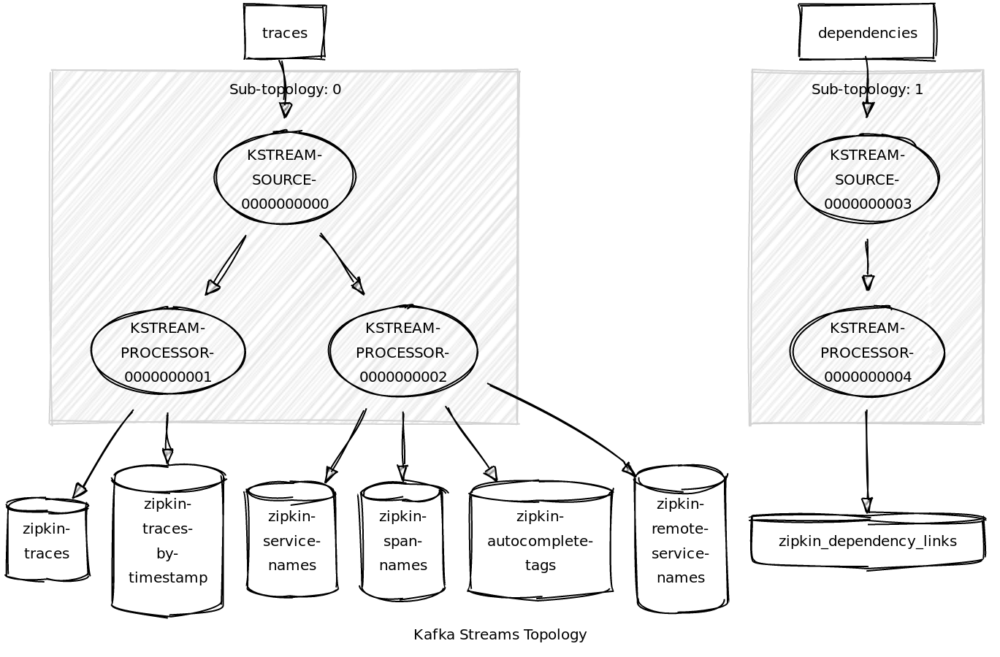

# Design

## Goals

* Provide a fast and reliable storage that enable extensibility via Kafka topics.
* Provide full storage functionality via streaming aggregations (e.g., dependency graph).
* Create a processing space where additional enrichment can be plugged in into the processing 
pipeline.
* Remove need for additional storage when Kafka is available.
* More focused on supporting processing than storage: traces and dependency links are emitted 
downstream to support metrics aggregation. Storage is currently supported but in a single node.

## Kafka Zipkin Storage

Storage is composed by 3 main components: 

- Span Consumer: repartition of collected span batches into individual spans keyed by `traceId`
- Span Aggregation: stream processing of spans into aggregated traces and then into dependency links.
- Span Store: building local state stores to support search and query API.

### Kafka Span Consumer

This component processes collected span batches (via HTTP, Kafka, ActiveMQ, etc), 
take each element and re-indexed them by `traceId` on a Kafka topic (default name: `zipkin-spans`).

This component is currently compensating how `KafkaSender` (part of [Zipkin-Reporter](https://github.com/openzipkin/zipkin-reporter-java))
is reporting spans to Kafka, by grouping spans into batches and sending them to a un-keyed
Kafka topic.

Component source code: [KafkaSpanConsumer.java](storage/src/main/java/zipkin2/storage/kafka/KafkaSpanConsumer.java)

### Stream Processing

#### Span Aggregation

"Partitioned" Spans are processed to produced two aggregated streams: `Traces` and `Dependencies`.

**Traces**: 

Spans are grouped by ID and stored on a local
[Session window](https://kafka.apache.org/23/javadoc/org/apache/kafka/streams/kstream/SessionWindows.html),
where the `traceId` becomes the token, and session inactivity gap 
(i.e. period of time without receiving a span with the same session) 
defines if a trace is still active or not. This is evaluated on the next span received on the stream--
regardless of incoming `traceId`. If session window is closed, a trace message is emitted to a topic
downstream (default name: `zipkin-trace`)

**Dependencies**

Once `traces` are emitted downstream as part of the initial processing, dependency links are evaluated
on each trace, and emitted on another topic (default name: `zipkin-dependency`) for further metric aggregation.

Kafka Streams topology:

#### Trace Store Stream

This component build local stores from state received on `spans` Kafka topic 
(default topic name: `zipkin-spans`) for traces, service names and autocomplete tags. 

Kafka Streams source code: [TraceStoreTopologySupplier](storage/src/main/java/zipkin2/storage/kafka/streams/TraceStoreTopologySupplier.java)

Kafka Streams topology:

#### Dependency Store

This component build local store from state received on `dependency` Kafka topic (default name: `zipkin-dependency`)

It builds a 1 minute time-window when counts calls and errors.

Kafka Streams source code: [DependencyStoreTopologySupplier](storage/src/main/java/zipkin2/storage/kafka/streams/DependencyStoreTopologySupplier.java)

Kafka Streams topology:

### Kafka Span Store

This component supports search and query APIs on top of local state stores build by the Store 
Kafka Streams component.

Component source code: [KafkaSpanStore.java](storage/src/main/java/zipkin2/storage/kafka/KafkaSpanStore.java)

#### Get Service Names/Get Span Names/Get Remote Service Names

These queries are supported by service names indexed stores built from `spans` Kafka topic.

Store names:

- `zipkin-service-names`: key/value store with service name as key and value.
- `zipkin-span-names`: key/value store with service name as key and span names list as value.
- `zipkin-remote-service-names`: key/value store with service name as key and remote service names as value.

#### Get Trace/Find Traces

These queries are supported by two key value stores: 

- `zipkin-traces`: indexed by `traceId`, contains span list status received from `spans` Kafka topic.
- `zipkin-traces-by-timestamp`: list of trace IDs indexed by `timestamp`.

`GetTrace` query is supported by `zipkin-traces` store.
`FindTraces` query is supported by both: When receiving a query request time range is used to get
trace IDs, and then query request is tested on each trace to build a response.

#### Get Dependencies

This query is supported 1-minute windowed store from `DependencyStoreStream`.

When a request is received, time range is used to pick valid windows and join counters.

Windowed store:

- `zipkin-dependencies`.

### Kafka Autocomplete Tags

#### Get Keys/Get Values

Supported by a key-value containing list of values valid for `autocompleteKeys`.

- `zipkin-autocomplete-tags`: key-value store.
