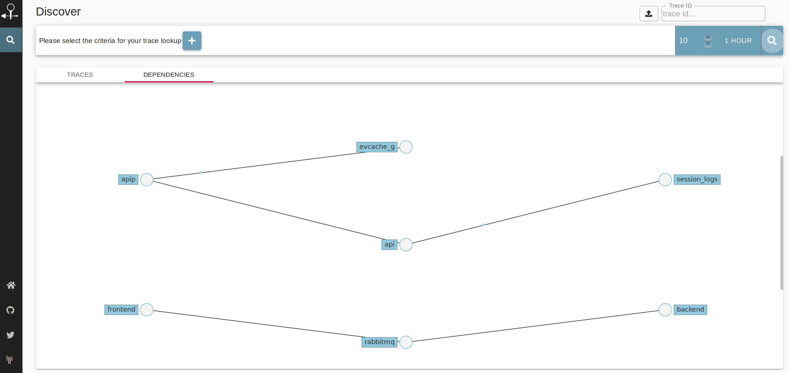

# Zipkin Storage: Kafka *[EXPERIMENTAL]*

[](https://www.travis-ci.org/openzipkin-contrib/zipkin-storage-kafka)
[](https://jitpack.io/#openzipkin-contrib/zipkin-storage-kafka)
[](https://microbadger.com/images/openzipkincontrib/zipkin-storage-kafka "Get your own version badge on microbadger.com")

Kafka-based storage for Zipkin.

```
                    +----------------------------*zipkin*----------------------------------------------
                    |                                     [ dependency-store ]--->( dependencies      )
                    |                                                  ^      +-->( autocomplete-tags )
( collected-spans )-|->[ span-consumer ]  [ aggregation ]    [ trace-store ]--+-->( traces            )
  via http, kafka,  |       |                    ^    |         ^      |      +-->( service-names     )
  amq, grpc, etc.   +-------|--------------------|----|---------|------|-------------------------------
                            |                    |    |         |      |
----------------------------|--------------------|----|---------|------|-------------------------------
                            +-->( spans )--------+----+---------|      |
                                                      |         |      |
*kafka*                                               +->( traces )    |
 topics                                               |                |
                                                      +->( dependencies )

-------------------------------------------------------------------------------------------------------

```

> Spans collected via different transports are partitioned by `traceId` and stored in a "spans" Kafka topic.
Partitioned spans are then aggregated into traces and then into dependency links, both
results are emitted into Kafka topics as well.
These 3 topics are used as source for local stores (Kafka Stream stores) that support Zipkin query and search APIs.

[Design notes](storage/DESIGN.md)

[Configuration](module/README.md)

## Building

To build the project you will need Java 8+.

```bash
make build
```

And testing:

```bash
make test
```

If you want to build a docker image:

```bash
make docker-build
```

### Run locally

To run locally, first you need to get Zipkin binaries:

```bash
make get-zipkin
```

By default Zipkin will be waiting for a Kafka broker to be running on `localhost:19092`. 

Then run Zipkin locally:

```bash
make run-local
```

To validate storage make sure that Kafka topics are created so Kafka Stream instances can be
initialized properly:

```bash
make kafka-topics
make zipkin-test
```

This will start a browser and check a traces has been registered.

It will send another trace after a minute (`trace timeout`) + 1 second to trigger
aggregation and visualize dependency graph.

### Run with Docker

If you have Docker available, run:

```bash
make run-docker
```

And Docker image will be built and Docker compose will start.

To test it, run:

```bash
make zipkin-test-single
# or
make zipkin-test-distributed
```




### Examples

+ [Single-node](docker/single/docker-compose.yml): span partitioning, aggregation, and storage happen on the same containers.
+ [Distributed-mode](docker/distributed/docker-compose.yml): partitioning and aggregation is in a different container than storage.
+ [Only-dependencies](docker/dependencies/docker-compose.yml): only components to support dependency graphs.

## Acknowledgments

This project is inspired in Adrian Cole's VoltDB storage <https://github.com/adriancole/zipkin-voltdb>

Kafka Streams images are created with <https://zz85.github.io/kafka-streams-viz/>
